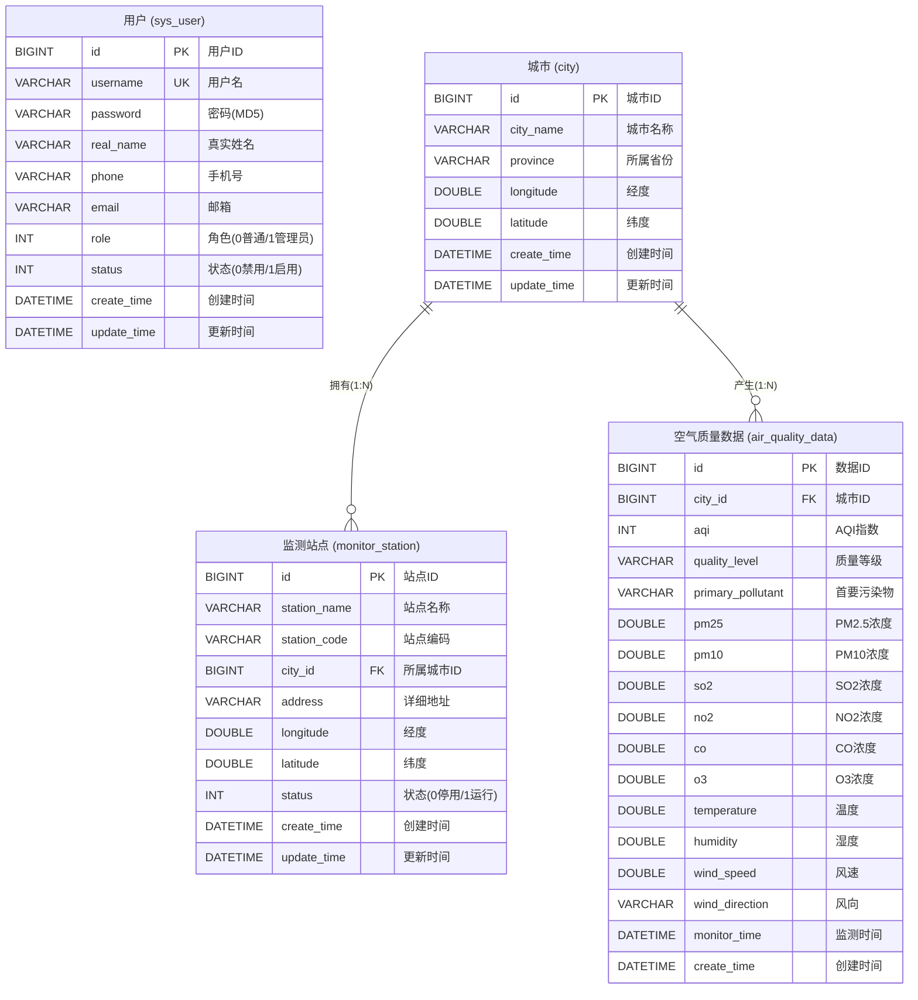

# 城市空气质量监测与可视化系统 E-R图设计

> 说明：本文档遵循概念数据模型（CDM）的标准E-R图绘制规范：
> - **矩形（□）** 表示实体
> - **椭圆（○）** 表示属性
> - **菱形（◇）** 表示联系（关系）
> - **下划线属性** 为主键
> - **连线标注** 1:N / 1:1 / M:N 表示联系的基数

---

## 一、分E-R图

### 1.1 用户实体 E-R图

```
                         ┌──────┐
                         │ 用户 │
                         └──┬───┘
           ┌───────┬───────┼───────┬────────┬────────┐
           │       │       │       │        │        │
         ╭───╮  ╭────╮ ╭────╮  ╭────╮  ╭─────╮ ╭─────╮
         │用户│  │用户│ │ 密 │  │真实│  │ 手机│ │ 邮箱│
         │ ID│  │ 名 │ │ 码 │  │姓名│  │ 号码│ │     │
         ╰─┬─╯  ╰────╯ ╰────╯  ╰────╯  ╰─────╯ ╰─────╯
           │
         (PK)
           │
     ╭─────┴─────╮
     │            │
  ╭────╮      ╭──────╮
  │角色│      │ 状态 │
  │    │      │      │
  ╰────╯      ╰──────╯
  (0普通/     (0禁用/
   1管理员)    1启用)
```

**属性说明：**

| 属性 | 类型 | 说明 |
|------|------|------|
| <u>用户ID</u> | BIGINT | 主键，唯一标识 |
| 用户名 | VARCHAR(50) | 登录账号，唯一 |
| 密码 | VARCHAR(64) | MD5加密存储 |
| 真实姓名 | VARCHAR(50) | 用户真实姓名 |
| 手机号码 | VARCHAR(20) | 联系电话 |
| 邮箱 | VARCHAR(100) | 电子邮箱 |
| 角色 | INT | 0-普通用户，1-管理员 |
| 状态 | INT | 0-禁用，1-启用 |

---

### 1.2 城市实体 E-R图

```
                     ╭──────╮
                     │城市ID│
                     ╰──┬───╯
                        │(PK)
                        │
        ╭─────╮    ┌────┴───┐    ╭──────╮
        │省份  │────│  城市  │────│城市名│
        ╰─────╯    └────┬───┘    ╰──────╯
                        │
               ┌────────┴────────┐
               │                 │
           ╭──────╮          ╭─────╮
           │ 经度 │          │纬度 │
           ╰──────╯          ╰─────╯
```

**属性说明：**

| 属性 | 类型 | 说明 |
|------|------|------|
| <u>城市ID</u> | BIGINT | 主键，唯一标识 |
| 城市名称 | VARCHAR(50) | 城市名称 |
| 省份 | VARCHAR(50) | 所属省份 |
| 经度 | DOUBLE | 地理经度坐标 |
| 纬度 | DOUBLE | 地理纬度坐标 |

---

### 1.3 监测站点实体 E-R图

```
                           ╭───────╮
                           │站点ID │
                           ╰───┬───╯
                               │(PK)
                               │
     ╭──────╮   ╭──────╮  ┌───┴────┐  ╭──────╮   ╭──────╮
     │站点名│───│站点编│──│ 监测   │──│详细地│───│ 状态 │
     │  称  │   │  码  │  │ 站点   │  │  址  │   │      │
     ╰──────╯   ╰──────╯  └───┬────┘  ╰──────╯   ╰──────╯
                               │              (0停用/1运行)
                      ┌────────┴────────┐
                      │                 │
                  ╭──────╮          ╭─────╮
                  │ 经度 │          │纬度 │
                  ╰──────╯          ╰─────╯
```

**属性说明：**

| 属性 | 类型 | 说明 |
|------|------|------|
| <u>站点ID</u> | BIGINT | 主键，唯一标识 |
| 站点名称 | VARCHAR(100) | 站点全称 |
| 站点编码 | VARCHAR(50) | 唯一编码（如BJ001） |
| 详细地址 | VARCHAR(200) | 站点所在具体位置 |
| 经度 | DOUBLE | 站点地理经度 |
| 纬度 | DOUBLE | 站点地理纬度 |
| 状态 | INT | 0-已停用，1-运行中 |

---

### 1.4 空气质量数据实体 E-R图

```
                              ╭───────╮
                              │数据ID │
                              ╰───┬───╯
                                  │(PK)
                                  │
  ╭─────╮  ╭─────╮  ╭─────╮  ┌───┴───────┐  ╭─────╮  ╭─────╮  ╭──────╮
  │ AQI │──│质量 │──│首要 │──│ 空气质量  │──│PM2.5│──│PM10 │──│ SO2  │
  │指数 │  │等级 │  │污染物│  │   数据    │  │     │  │     │  │      │
  ╰─────╯  ╰─────╯  ╰─────╯  └───┬───────┘  ╰─────╯  ╰─────╯  ╰──────╯
                                   │
         ┌──────┬──────┬───────┬───┴───┬───────┬───────┬───────┐
         │      │      │       │       │       │       │       │
      ╭────╮╭────╮╭─────╮╭─────╮╭─────╮╭─────╮╭─────╮╭──────╮
      │NO2 ││ CO ││ O3  ││ 温度││湿度 ││风速 ││风向 ││监测  │
      │    ││    ││     ││     ││     ││     ││     ││时间  │
      ╰────╯╰────╯╰─────╯╰─────╯╰─────╯╰─────╯╰─────╯╰──────╯
```

**属性说明：**

| 属性 | 类型 | 说明 |
|------|------|------|
| <u>数据ID</u> | BIGINT | 主键，唯一标识 |
| AQI指数 | INT | 空气质量指数（0~500） |
| 质量等级 | VARCHAR(20) | 优/良/轻度污染/中度污染/重度污染/严重污染 |
| 首要污染物 | VARCHAR(20) | 如PM2.5、PM10、O3等 |
| PM2.5 | DOUBLE | PM2.5浓度（μg/m³） |
| PM10 | DOUBLE | PM10浓度（μg/m³） |
| SO2 | DOUBLE | 二氧化硫浓度（μg/m³） |
| NO2 | DOUBLE | 二氧化氮浓度（μg/m³） |
| CO | DOUBLE | 一氧化碳浓度（mg/m³） |
| O3 | DOUBLE | 臭氧浓度（μg/m³） |
| 温度 | DOUBLE | 环境温度（℃） |
| 湿度 | DOUBLE | 环境湿度（%） |
| 风速 | DOUBLE | 风速（m/s） |
| 风向 | VARCHAR(10) | 北/东北/东/东南/南/西南/西/西北 |
| 监测时间 | DATETIME | 数据采集时间 |

---

## 二、总E-R图（全局概念数据模型）

```
                                ┌──────┐
                                │ 用户 │
                                └──────┘
                            （独立实体，无外键关联）


 ╭──────╮                                                      ╭──────╮
 │站点名│                                                      │ AQI  │
 ╰──┬───╯                                                      ╰──┬───╯
    │       ╭──────╮                          ╭──────╮            │       ╭──────╮
    │       │站点编│                          │质量  │            │       │PM2.5 │
    │       │  码  │                          │等级  │            │       ╰──┬───╯
    │       ╰──┬───╯                          ╰──┬───╯               │
    │          │                                 │                    │
    │     ┌────┴─────┐        1           N  ┌───┴────────┐     ╭───┴──╮
    ├─────│  监测    │◄──────────────────────│  空气质量  │─────│PM10  │
    │     │  站点    │         产生           │    数据    │     ╰──────╯
    │     └────┬─────┘                       └───┬────────┘
    │          │                                 │
 ╭──┴──╮      │                                 │       ╭──────╮
 │地址 │      │                                 ├───────│ SO2  │
 ╰─────╯      │           ◇                    │       ╰──────╯
               │       ╱       ╲                │
 ╭──────╮     │     ╱   拥有    ╲              │       ╭──────╮
 │ 状态 │     │    ◇   (1:N)    ◇             ├───────│ NO2  │
 ╰──────╯     │     ╲           ╱              │       ╰──────╯
               │       ╲       ╱                │
               │           ◇                    │       ╭──────╮
               │           │                    ├───────│  CO  │
               │           │                    │       ╰──────╯
               │     ┌─────┴─────┐              │
               └─────│   城市    │──────────────┘       ╭──────╮
                     └─────┬─────┘                ├─────│  O3  │
                           │           ◇               ╰──────╯
          ┌────────┬───────┼───────┐ ╱     ╲
          │        │       │       │◇ 产生  ◇     ╭──────╮
       ╭─────╮╭──────╮╭──────╮╭──────╮╲(1:N)╱────│监测  │
       │城市 ││ 省份 ││ 经度 ││ 纬度 │  ╲ ╱      │时间  │
       │ 名  ││      ││      ││      │   ◇       ╰──────╯
       ╰─────╯╰──────╯╰──────╯╰──────╯
```

---

## 三、总E-R图（简洁标准版）

以下为标准概念数据模型格式的总E-R图，清晰展示实体、联系及基数约束：

```
┌─────────────────────────────────────────────────────────────────────────────┐
│                         系统总 E-R 图                                        │
└─────────────────────────────────────────────────────────────────────────────┘


         ┌──────────┐                            ┌──────────┐
         │          │                            │          │
         │   用户   │                            │   城市   │
         │ (User)   │                            │ (City)   │
         │          │                            │          │
         └──────────┘                            └────┬─────┘
                                                      │
              ┌───────────────────────────────────────┼────────────────────┐
              │                                       │                    │
              │ 1                                     │ 1                  │
              │                                       │                    │
         ╱─────────╲                            ╱─────────╲               │
        ╱             ╲                        ╱             ╲             │
       │    拥有       │                      │    产生       │             │
       │   (belong)    │                      │  (generate)   │             │
        ╲             ╱                        ╲             ╱             │
         ╲─────────╱                            ╲─────────╱               │
              │                                       │                    │
              │ N                                     │ N                  │
              │                                       │                    │
         ┌────┴─────┐                            ┌────┴─────┐             │
         │          │                            │          │             │
         │  监测    │                            │ 空气质量 │             │
         │  站点    │                            │   数据   │             │
         │(Station) │                            │(AQData)  │             │
         │          │                            │          │             │
         └──────────┘                            └──────────┘             │
                                                                          │
                                                                          │
                                                                          │

   ┌─────────────────────────────────────────────────────────────────────┐
   │                      实体属性一览                                     │
   ├─────────────────────────────────────────────────────────────────────┤
   │                                                                     │
   │  ┌──────┐  属性：ID*, 用户名, 密码, 真实姓名, 手机, 邮箱, 角色, 状态 │
   │  │ 用户 │                                                           │
   │  └──────┘                                                           │
   │                                                                     │
   │  ┌──────┐  属性：ID*, 城市名, 省份, 经度, 纬度                       │
   │  │ 城市 │                                                           │
   │  └──────┘                                                           │
   │                                                                     │
   │  ┌──────┐  属性：ID*, 站点名, 编码, #城市ID, 地址, 经度, 纬度, 状态  │
   │  │ 站点 │                                                           │
   │  └──────┘                                                           │
   │                                                                     │
   │  ┌──────┐  属性：ID*, #城市ID, AQI, 等级, 首要污染物, PM2.5, PM10,  │
   │  │ 数据 │        SO2, NO2, CO, O3, 温度, 湿度, 风速, 风向, 监测时间 │
   │  └──────┘                                                           │
   │                                                                     │
   │  说明：* 表示主键    # 表示外键                                       │
   └─────────────────────────────────────────────────────────────────────┘
```

---

## 四、总E-R图（Mermaid标准格式，可渲染）

> 以下Mermaid代码可在 Typora、VS Code (Mermaid插件)、GitHub、draw.io 等工具中直接渲染为标准ER图



---

## 五、实体间联系汇总表

| 联系名称 | 实体1 | 实体2 | 联系类型 | 说明 |
|---------|-------|-------|---------|------|
| 拥有 | 城市 | 监测站点 | 1 : N | 一个城市拥有多个监测站点，一个站点只属于一个城市 |
| 产生 | 城市 | 空气质量数据 | 1 : N | 一个城市产生多条空气质量监测记录，每条记录对应一个城市 |
| — | 用户 | — | 独立实体 | 用户实体独立存在，负责系统访问控制，与业务数据无外键关联 |

---

## 六、各分E-R图的联系详解

### 6.1 城市—监测站点联系 E-R图

```
    ┌──────────┐           ╱─────────╲           ┌──────────┐
    │          │    1     ╱             ╲    N    │          │
    │   城市   │─────────│    拥有      │─────────│  监测    │
    │  (City)  │         │  (belong)    │         │  站点    │
    │          │          ╲             ╱         │(Station) │
    └──────────┘           ╲─────────╱           └──────────┘
    │属性：    │                                   │属性：    │
    │ ID(PK)   │                                   │ ID(PK)   │
    │ 城市名   │                                   │ 站点名   │
    │ 省份     │                                   │ 编码     │
    │ 经度     │                                   │ 城市ID(FK)│
    │ 纬度     │                                   │ 地址     │
    └──────────┘                                   │ 经度     │
                                                   │ 纬度     │
                                                   │ 状态     │
                                                   └──────────┘

    含义：一个城市可以拥有0个或多个监测站点；
          每个监测站点必须且仅属于一个城市。
    外键：monitor_station.city_id → city.id
```

### 6.2 城市—空气质量数据联系 E-R图

```
    ┌──────────┐           ╱─────────╲           ┌──────────────┐
    │          │    1     ╱             ╲    N    │              │
    │   城市   │─────────│    产生      │─────────│   空气质量   │
    │  (City)  │         │ (generate)   │         │     数据     │
    │          │          ╲             ╱         │  (AQData)    │
    └──────────┘           ╲─────────╱           └──────────────┘
    │属性：    │                                   │属性：        │
    │ ID(PK)   │                                   │ ID(PK)       │
    │ 城市名   │                                   │ 城市ID(FK)   │
    │ 省份     │                                   │ AQI          │
    │ 经度     │                                   │ 质量等级     │
    │ 纬度     │                                   │ 首要污染物   │
    └──────────┘                                   │ PM2.5~O3     │
                                                   │ 温度/湿度    │
                                                   │ 风速/风向    │
                                                   │ 监测时间     │
                                                   └──────────────┘

    含义：一个城市可以产生0条或多条空气质量监测记录；
          每条空气质量数据必须且仅对应一个城市。
    外键：air_quality_data.city_id → city.id
```

---

## 七、概念数据模型设计说明

### 7.1 设计原则

（1）**实体独立性**：每个实体具有明确的业务含义和独立的主键标识。

（2）**联系明确性**：实体间的联系通过菱形框标注，并明确标注基数约束（1:N）。

（3）**属性完整性**：每个实体的属性覆盖了实际业务中所需的所有数据项。

（4）**规范化设计**：数据库设计满足第三范式（3NF），消除了数据冗余和传递依赖。

### 7.2 从概念模型到逻辑模型的转换规则

| CDM概念 | 转换规则 | 对应物理结构 |
|---------|---------|-------------|
| 实体 | 转换为一张数据库表 | sys_user / city / monitor_station / air_quality_data |
| 属性 | 转换为表中的字段（列） | 各表的字段定义 |
| 主键属性 | 设置为PRIMARY KEY约束 | id字段（BIGINT AUTO_INCREMENT） |
| 1:N联系 | 在N端实体表中增加外键列 | city_id（FK引用city.id） |
| M:N联系 | 新建关联表（本系统无此情况） | — |

### 7.3 本系统的实体-联系特征

- **实体总数**：4个（用户、城市、监测站点、空气质量数据）
- **联系总数**：2个（拥有、产生）
- **联系类型**：全部为 1:N 关系
- **独立实体**：用户实体（与业务数据实体无直接外键关联）
- **核心实体**：城市实体（作为两个1:N联系中的"1"端）
