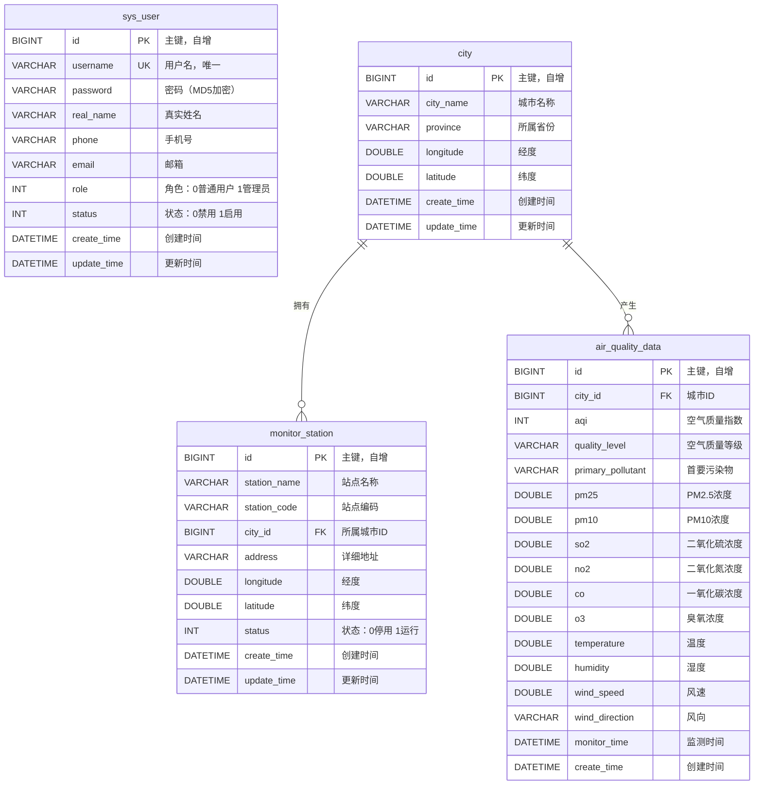

# 城市空气质量监测与可视化系统的设计与实现

---

**摘　要**

随着我国城市化进程的不断加快，空气污染问题日益严峻，已成为影响居民生活质量和身体健康的重要因素。及时、准确地监测城市空气质量数据，并以直观可视化的方式呈现，对于环境管理部门的科学决策和公众的健康防护具有重要意义。本文设计并实现了一个城市空气质量监测与可视化系统，采用前后端分离的B/S架构，后端基于Spring Boot框架，前端基于Vue.js框架，数据库采用MySQL进行持久化存储。系统实现了用户管理、城市管理、监测站点管理、空气质量数据管理、数据统计分析与可视化展示等核心功能模块。通过ECharts图表库实现了多维度的数据可视化，包括AQI趋势分析、污染物浓度雷达图、城市排名对比等。系统具有操作简便、响应迅速、数据展示直观等特点，能够有效满足城市空气质量监测与分析的实际需求。

**关键词：** 空气质量监测；数据可视化；Spring Boot；Vue.js；ECharts；B/S架构

---

**Abstract**

With the acceleration of urbanization in China, air pollution has become an increasingly serious issue that significantly affects residents' quality of life and health. Timely and accurate monitoring of urban air quality data, presented through intuitive visualization, is of great significance for scientific decision-making by environmental management departments and public health protection. This paper designs and implements an urban air quality monitoring and visualization system, adopting a front-end and back-end separated B/S architecture. The back-end is based on the Spring Boot framework, the front-end is based on the Vue.js framework, and MySQL is used for persistent data storage. The system implements core functional modules including user management, city management, monitoring station management, air quality data management, statistical analysis, and visualization. Multi-dimensional data visualization is achieved through the ECharts chart library, including AQI trend analysis, pollutant concentration radar charts, and city ranking comparisons. The system features easy operation, rapid response, and intuitive data display, effectively meeting the practical needs of urban air quality monitoring and analysis.

**Keywords:** Air quality monitoring; Data visualization; Spring Boot; Vue.js; ECharts; B/S architecture

---

## 第一章　绪论

### 1.1　研究背景与意义

近年来，随着我国工业化和城市化进程的快速推进，大气污染问题日益突出。雾霾、PM2.5超标、臭氧污染等环境问题频繁发生，严重威胁着城市居民的身体健康和生活质量。根据世界卫生组织（WHO）的研究报告，全球每年因空气污染导致的过早死亡人数高达数百万。因此，建立完善的空气质量监测体系，实时掌握大气污染物的浓度变化趋势，对于环境保护和公众健康具有重要的现实意义。

传统的空气质量监测方式主要依赖人工采样和实验室分析，存在数据获取周期长、信息传递滞后、数据展示不够直观等问题。随着物联网技术和Web技术的快速发展，基于互联网的空气质量监测系统逐渐成为环境监测领域的研究热点。通过Web平台实现空气质量数据的实时采集、存储、分析和可视化展示，能够极大地提高环境监测的效率和数据利用水平。

本课题旨在设计并实现一个城市空气质量监测与可视化系统，利用现代Web开发技术，构建一个功能完善、操作便捷、展示直观的空气质量信息管理与分析平台。系统能够对包括AQI（空气质量指数）、PM2.5、PM10、SO₂、NO₂、CO、O₃等多种污染物指标进行综合管理和可视化分析，为环境管理人员提供科学的决策支持，同时为公众提供便捷的空气质量信息查询服务。

### 1.2　国内外研究现状

#### 1.2.1　国外研究现状

在空气质量监测领域，发达国家起步较早，已建立了较为完善的监测体系。美国环境保护署（EPA）建立了全国范围的空气质量监测网络（AirNow），覆盖数千个监测站点，能够实时发布各地空气质量指数。欧盟通过"空气质量指令"（Air Quality Directive）建立了统一的空气质量监测标准和数据共享平台。在技术层面，国外学者在空气质量数据的可视化方面进行了大量研究，利用地理信息系统（GIS）、数据挖掘和机器学习等技术，实现了空气质量数据的时空分析和预测。

#### 1.2.2　国内研究现状

我国的空气质量监测工作经过多年发展，已取得显著成效。生态环境部建立了全国城市空气质量实时发布平台，覆盖300多个地级及以上城市，实时发布AQI、PM2.5等监测数据。在技术应用方面，国内研究者广泛采用Spring Boot、Vue.js等主流框架开发环境监测信息系统，利用ECharts、D3.js等可视化工具实现数据的多维度展示。然而，现有系统在数据可视化的丰富度、用户交互体验、系统响应效率等方面仍有提升空间。

### 1.3　研究内容与目标

本课题的主要研究内容包括：

（1）分析城市空气质量监测与可视化系统的功能需求，进行系统的总体设计和详细设计。

（2）采用Spring Boot框架构建后端RESTful API服务，实现业务逻辑处理和数据持久化。

（3）采用Vue.js框架构建前端单页应用，实现用户界面交互和数据展示。

（4）利用ECharts图表库实现空气质量数据的多维度可视化，包括趋势分析、对比分析、分布统计等。

（5）对系统进行功能测试和性能优化，确保系统的稳定性和可用性。

### 1.4　论文组织结构

本论文共分为六章，各章节内容安排如下：

第一章为绪论，介绍课题的研究背景与意义、国内外研究现状、研究内容与目标。

第二章为相关技术介绍，对系统开发所涉及的关键技术进行阐述。

第三章为系统需求分析，从功能需求和非功能需求两个方面进行详细分析。

第四章为系统设计，包括系统总体架构设计、数据库设计（含ER图）、接口设计等。

第五章为系统实现与测试，展示系统各功能模块的具体实现过程和测试结果。

第六章为总结与展望，总结全文工作并对未来改进方向进行展望。

---

## 第二章　相关技术介绍

### 2.1　Spring Boot框架

Spring Boot是由Pivotal团队提供的基于Spring框架的快速开发脚手架，其核心设计理念是"约定优于配置"。Spring Boot通过自动配置（Auto-Configuration）机制，大幅减少了传统Spring项目中繁琐的XML配置工作，使开发者能够快速搭建基于Spring的企业级应用。

本系统采用Spring Boot 2.7.18版本，主要利用了以下特性：

（1）内嵌Tomcat服务器，无需额外部署Web容器，简化了项目的发布和运行流程。

（2）Spring MVC模块提供了RESTful API的开发支持，通过@RestController、@RequestMapping等注解实现请求映射和响应处理。

（3）Spring Boot Starter机制简化了依赖管理，通过引入相应的Starter即可自动配置所需组件。

（4）统一的异常处理机制，通过@RestControllerAdvice实现全局异常捕获和统一响应格式。

### 2.2　MyBatis持久层框架

MyBatis是一款优秀的持久层框架，它支持自定义SQL、存储过程以及高级映射。MyBatis免除了几乎所有的JDBC代码以及设置参数和获取结果集的工作，可以通过简单的XML或注解来配置和映射原始类型、接口和Java POJO为数据库中的记录。

本系统采用MyBatis结合PageHelper分页插件实现数据访问层，主要优势包括：

（1）灵活的SQL编写方式，支持在XML映射文件中编写复杂的动态SQL。

（2）良好的与Spring Boot的集成支持，通过mybatis-spring-boot-starter实现自动配置。

（3）支持驼峰命名自动映射（map-underscore-to-camel-case），简化了实体类与数据库字段的映射配置。

（4）PageHelper插件提供了便捷的物理分页功能，支持MySQL等主流数据库。

### 2.3　Vue.js前端框架

Vue.js是一套用于构建用户界面的渐进式JavaScript框架，由尤雨溪于2014年发布。Vue的核心库专注于视图层，易于上手，同时便于与第三方库或已有项目整合。

本系统前端采用Vue 2.6.14版本，配合以下技术栈：

（1）Vue Router 3.x：实现前端路由管理，支持路由守卫（Navigation Guards）进行访问权限控制。

（2）Vuex 3.x：实现集中式状态管理，管理用户登录状态等全局共享数据。

（3）Axios 0.27.x：基于Promise的HTTP客户端，用于与后端API进行数据交互，支持请求/响应拦截器。

（4）Element UI 2.15.x：一套基于Vue 2.0的桌面端组件库，提供了丰富的UI组件，如表格、表单、对话框、分页等。

### 2.4　ECharts数据可视化库

ECharts是百度开源的一个基于JavaScript的数据可视化库，提供了丰富的图表类型和交互功能。本系统采用ECharts 5.4.3版本，利用其以下图表类型实现数据可视化：

（1）柱状图（Bar Chart）：用于展示各城市最新AQI数值对比。

（2）饼图（Pie Chart）：用于展示空气质量等级分布比例。

（3）折线图（Line Chart）：用于展示AQI和污染物浓度的时间变化趋势。

（4）雷达图（Radar Chart）：用于展示各类污染物平均浓度的多维度对比。

（5）散点图（Scatter Chart）：用于分析PM2.5浓度与AQI之间的相关性。

（6）面积图（Area Chart）：用于展示各污染物浓度随时间的堆叠变化。

### 2.5　MySQL数据库

MySQL是最流行的关系型数据库管理系统之一，具有体积小、速度快、开源免费等优点。本系统采用MySQL 8.0版本，使用InnoDB存储引擎，支持事务处理和外键约束。数据库字符集采用utf8mb4，能够完整支持Unicode字符集，包括中文和特殊字符的存储。

### 2.6　其他相关技术

（1）Druid连接池：阿里巴巴开源的数据库连接池组件，具有强大的监控功能和良好的性能表现。

（2）Lombok：Java库，通过注解方式自动生成getter/setter、构造方法等样板代码，简化实体类的编写。

（3）Hutool工具库：提供了丰富的Java工具方法，本系统主要使用其MD5加密功能实现密码加密存储。

（4）Vue CLI：Vue.js的标准构建工具，提供了项目脚手架、开发服务器、构建打包等功能。

### 2.7　本章小结

本章介绍了系统开发过程中使用的关键技术，包括后端的Spring Boot框架和MyBatis持久层框架、前端的Vue.js框架和ECharts可视化库，以及MySQL数据库等。这些技术的选型充分考虑了系统的功能需求、开发效率和运行性能，为系统的设计与实现奠定了技术基础。

---

## 第三章　系统需求分析

### 3.1　系统概述

城市空气质量监测与可视化系统旨在为环境管理部门和社会公众提供一个全面、直观的空气质量信息管理与展示平台。系统需要实现对城市空气质量监测数据的录入、存储、查询、统计分析和可视化展示等功能，同时需要具备良好的用户权限管理和系统安全性。

### 3.2　功能需求分析

通过对系统用户的需求调研和分析，本系统的功能需求可以划分为以下几个主要模块：

#### 3.2.1　用户管理模块

用户管理模块是系统安全性的基础保障，主要功能需求包括：

（1）用户登录：用户通过用户名和密码进行身份认证，密码采用MD5加密传输和存储。

（2）用户信息管理：管理员可以对系统用户进行增加、删除、修改和查询操作。

（3）角色权限控制：系统分为管理员（admin）和普通用户（user）两种角色，管理员拥有用户管理等高级权限。

（4）用户状态管理：支持启用和禁用用户账号，被禁用的用户无法登录系统。

#### 3.2.2　城市管理模块

城市管理模块负责维护监测城市的基本信息，主要功能需求包括：

（1）城市信息的增删改查（CRUD）操作。

（2）支持按城市名称或省份进行模糊搜索。

（3）记录城市的经纬度坐标信息，为后续的地理分析提供数据支持。

#### 3.2.3　监测站点管理模块

监测站点管理模块负责维护各城市空气质量监测站点的信息，主要功能需求包括：

（1）监测站点信息的增删改查操作。

（2）站点与城市的关联管理，每个站点归属于特定城市。

（3）站点状态管理，支持"运行中"和"已停用"两种状态。

（4）支持按站点名称、编码或所属城市进行搜索查询。

#### 3.2.4　空气质量数据管理模块

空气质量数据管理模块是系统的核心业务模块，主要功能需求包括：

（1）空气质量数据的录入、编辑和删除操作。

（2）支持按城市、空气质量等级、时间范围等条件进行数据筛选查询。

（3）分页显示查询结果，支持自定义每页显示条数（10/20/50条）。

（4）记录的数据指标包括：AQI、空气质量等级、首要污染物、PM2.5、PM10、SO₂、NO₂、CO、O₃、温度、湿度、风速、风向等。

#### 3.2.5　数据统计与可视化模块

数据统计与可视化模块是系统的特色功能，主要需求包括：

（1）综合仪表盘：展示城市数量、站点数量、数据总量、当日数据量等统计信息。

（2）AQI实时对比：以柱状图展示各城市最新AQI数值，并根据污染等级着色。

（3）空气质量等级分布：以饼图展示不同空气质量等级的数据占比。

（4）城市AQI排名：以水平条形图展示AQI均值排名前十的城市。

（5）AQI趋势分析：以折线图展示指定城市在一段时间内的AQI、PM2.5、PM10变化趋势。

（6）污染物浓度雷达图：以雷达图多维度展示各类污染物的平均浓度。

（7）PM2.5与AQI散点分析：以散点图分析PM2.5浓度与AQI之间的相关关系。

（8）污染物浓度堆叠面积图：展示各污染物浓度随时间的变化和占比。

### 3.3　非功能需求分析

#### 3.3.1　性能需求

（1）系统页面加载时间不超过3秒，API响应时间不超过1秒。

（2）系统支持至少50个用户同时在线操作。

（3）数据库查询需要合理使用索引优化，确保大数据量下的查询效率。

#### 3.3.2　安全性需求

（1）用户密码必须加密存储，不得明文保存。

（2）系统需要实现基本的访问控制，未登录用户不能访问系统功能。

（3）敏感操作（如用户管理）需要管理员权限。

（4）后端接口需要进行参数校验，防止非法数据注入。

#### 3.3.3　可用性需求

（1）系统界面简洁美观，操作流程符合用户使用习惯。

（2）提供友好的错误提示信息，帮助用户快速定位问题。

（3）图表展示具有交互性，支持数据缩放和提示框显示。

#### 3.3.4　可维护性需求

（1）系统采用前后端分离架构，便于独立开发和维护。

（2）代码结构清晰，遵循分层架构设计，便于功能扩展。

（3）数据库设计规范，表结构合理，便于后续数据迁移和升级。

### 3.4　本章小结

本章从功能需求和非功能需求两个维度对系统进行了详细的需求分析。功能方面，系统需要实现用户管理、城市管理、监测站点管理、空气质量数据管理和数据统计可视化五大模块；非功能方面，系统需要满足性能、安全性、可用性和可维护性等方面的要求。需求分析为后续的系统设计和实现提供了明确的指导。

---

## 第四章　系统设计

### 4.1　系统总体架构设计

本系统采用前后端分离的B/S（Browser/Server）架构，整体架构分为三个层次：表现层、业务逻辑层和数据访问层。系统总体架构如图4-1所示。

```
┌─────────────────────────────────────────────────────────────────┐
│                        客户端（浏览器）                           │
│  ┌──────────┐ ┌──────────┐ ┌──────────┐ ┌───────────────────┐  │
│  │ Vue.js   │ │ Vuex     │ │ Vue      │ │ ECharts           │  │
│  │ 组件     │ │ 状态管理  │ │ Router   │ │ 数据可视化         │  │
│  └──────────┘ └──────────┘ └──────────┘ └───────────────────┘  │
│  ┌──────────┐ ┌──────────┐                                     │
│  │ Element  │ │ Axios    │                                     │
│  │ UI组件库 │ │ HTTP通信  │                                     │
│  └──────────┘ └──────────┘                                     │
└───────────────────────┬─────────────────────────────────────────┘
                        │  HTTP / RESTful API
                        ▼
┌─────────────────────────────────────────────────────────────────┐
│                     服务端（Spring Boot）                         │
│                                                                 │
│  ┌─────────────────────────────────────────────────────────┐    │
│  │              Controller层（控制器层）                      │    │
│  │  UserController  CityController  StationController      │    │
│  │  AirQualityDataController                               │    │
│  └────────────────────────┬────────────────────────────────┘    │
│                           │                                     │
│  ┌────────────────────────▼────────────────────────────────┐    │
│  │                Service层（业务逻辑层）                     │    │
│  │  UserService  CityService  MonitorStationService        │    │
│  │  AirQualityDataService                                  │    │
│  └────────────────────────┬────────────────────────────────┘    │
│                           │                                     │
│  ┌────────────────────────▼────────────────────────────────┐    │
│  │               Mapper层（数据访问层/MyBatis）               │    │
│  │  UserMapper  CityMapper  MonitorStationMapper           │    │
│  │  AirQualityDataMapper                                   │    │
│  └────────────────────────┬────────────────────────────────┘    │
│                           │                                     │
│  ┌─────────────────────────────────────────────────────────┐    │
│  │  全局配置：CorsConfig | GlobalExceptionHandler          │    │
│  └─────────────────────────────────────────────────────────┘    │
└───────────────────────────┬─────────────────────────────────────┘
                            │  JDBC（Druid连接池）
                            ▼
┌─────────────────────────────────────────────────────────────────┐
│                     数据层（MySQL 8.0）                           │
│  ┌──────────┐ ┌──────────┐ ┌───────────────┐ ┌──────────────┐  │
│  │ sys_user │ │  city    │ │monitor_station│ │air_quality_  │  │
│  │          │ │          │ │               │ │    data      │  │
│  └──────────┘ └──────────┘ └───────────────┘ └──────────────┘  │
└─────────────────────────────────────────────────────────────────┘
```

**图4-1　系统总体架构图**

系统各层次的职责划分如下：

（1）**表现层（前端）**：基于Vue.js框架构建单页应用（SPA），通过Axios与后端API进行数据交互，使用Element UI提供统一的界面风格，利用ECharts实现数据可视化图表的渲染。Vuex负责管理用户登录状态等全局数据，Vue Router实现页面路由和导航守卫。

（2）**业务逻辑层（后端）**：基于Spring Boot框架，采用经典的三层架构（Controller-Service-Mapper）。Controller层负责接收和解析HTTP请求，调用Service层处理业务逻辑；Service层封装核心业务逻辑，进行数据校验和处理；Mapper层通过MyBatis框架与数据库交互，执行SQL操作。

（3）**数据层**：采用MySQL 8.0数据库，通过Druid连接池管理数据库连接，保证数据访问的效率和稳定性。

### 4.2　功能模块设计

根据需求分析的结果，系统的功能模块划分如图4-2所示。

```
┌────────────────────────────────────────────────────────────┐
│              城市空气质量监测与可视化系统                       │
├──────────┬──────────┬──────────┬──────────┬────────────────┤
│ 用户管理 │ 城市管理  │ 站点管理 │ 数据管理  │ 可视化分析      │
│ 模块     │ 模块     │ 模块     │ 模块     │ 模块           │
├──────────┼──────────┼──────────┼──────────┼────────────────┤
│·用户登录 │·城市列表  │·站点列表 │·数据列表  │·综合仪表盘     │
│·用户列表 │·添加城市  │·添加站点 │·数据录入  │·AQI柱状对比    │
│·添加用户 │·编辑城市  │·编辑站点 │·数据编辑  │·等级饼图分布   │
│·编辑用户 │·删除城市  │·删除站点 │·数据删除  │·城市AQI排名    │
│·删除用户 │·城市搜索  │·站点搜索 │·条件筛选  │·趋势折线分析   │
│·角色控制 │·坐标管理  │·状态管理 │·分页展示  │·污染物雷达图   │
│·状态管理 │          │·城市关联 │·时间查询  │·PM2.5散点图    │
│          │          │          │          │·堆叠面积图     │
└──────────┴──────────┴──────────┴──────────┴────────────────┘
```

**图4-2　系统功能模块图**

### 4.3　数据库设计

#### 4.3.1　概念结构设计（E-R图）

根据系统的需求分析，本系统涉及四个核心实体：用户（User）、城市（City）、监测站点（MonitorStation）和空气质量数据（AirQualityData）。各实体之间的关系通过E-R图（实体-关系图）进行描述，如图4-3所示。

```
                          ┌─────────────────┐
                          │    sys_user      │
                          │    （用户）       │
                          ├─────────────────┤
                          │ ◆ id            │
                          │   username      │
                          │   password      │
                          │   real_name     │
                          │   phone         │
                          │   email         │
                          │   role          │
                          │   status        │
                          │   create_time   │
                          │   update_time   │
                          └─────────────────┘


    ┌─────────────────┐          1          ┌─────────────────────┐
    │ monitor_station  │◄─────────┐         │  air_quality_data   │
    │  （监测站点）     │          │         │  （空气质量数据）     │
    ├─────────────────┤          │         ├─────────────────────┤
    │ ◆ id            │          │         │ ◆ id                │
    │   station_name  │          │         │   ○ city_id         │
    │   station_code  │          │         │   aqi               │
    │   ○ city_id     │          │         │   quality_level     │
    │   address       │          │         │   primary_pollutant │
    │   longitude     │    ┌─────┴─────┐   │   pm25              │
    │   latitude      │    │   city    │   │   pm10              │
    │   status        │    │  （城市）  │   │   so2               │
    │   create_time   │    ├───────────┤   │   no2               │
    │   update_time   │    │ ◆ id      │   │   co                │
    └─────────────────┘    │  city_name│   │   o3                │
            ▲              │  province │   │   temperature       │
            │              │  longitude│   │   humidity           │
            │     N        │  latitude │   │   wind_speed        │
            └──────────────│  create_  │   │   wind_direction    │
            一个城市拥有     │  time    │   │   monitor_time      │
            多个监测站点     │  update_ │   │   create_time       │
                           │  time    │   └─────────────────────┘
                           └─────┬─────┘            ▲
                                 │        1         │
                                 └──────────────────┘
                                  一个城市拥有
                                  多条空气质量数据
                                       N
```

**图4-3　系统E-R图**

**◆ 表示主键（Primary Key）　　○ 表示外键（Foreign Key）**

各实体之间的关系说明如下：

（1）**城市（City）与监测站点（MonitorStation）**：一对多关系（1:N）。一个城市可以拥有多个监测站点，每个监测站点归属于一个城市。通过monitor_station表中的city_id外键字段关联city表的id字段。

（2）**城市（City）与空气质量数据（AirQualityData）**：一对多关系（1:N）。一个城市可以拥有多条空气质量监测数据记录，每条数据记录对应一个城市。通过air_quality_data表中的city_id外键字段关联city表的id字段。

（3）**用户（User）**：独立实体，与其他实体无直接外键关联。用户实体负责系统的访问控制和权限管理。

以下使用Mermaid语法提供一份可渲染的ER图，可以在支持Mermaid的编辑器中直接查看：



**图4-4　系统E-R图（Mermaid格式）**

#### 4.3.2　逻辑结构设计

根据E-R图的概念结构设计，将实体和关系转换为关系模式，得到以下四张数据库表的逻辑结构：

**表4-1　用户表（sys_user）结构**

| 字段名 | 数据类型 | 约束 | 说明 |
|--------|---------|------|------|
| id | BIGINT | PRIMARY KEY, AUTO_INCREMENT | 用户ID，主键 |
| username | VARCHAR(50) | UNIQUE, NOT NULL | 用户名 |
| password | VARCHAR(64) | NOT NULL | 密码（MD5加密） |
| real_name | VARCHAR(50) | — | 真实姓名 |
| phone | VARCHAR(20) | — | 手机号码 |
| email | VARCHAR(100) | — | 电子邮箱 |
| role | INT | DEFAULT 0 | 角色（0普通用户，1管理员） |
| status | INT | DEFAULT 1 | 状态（0禁用，1启用） |
| create_time | DATETIME | DEFAULT CURRENT_TIMESTAMP | 创建时间 |
| update_time | DATETIME | ON UPDATE CURRENT_TIMESTAMP | 更新时间 |

**表4-2　城市表（city）结构**

| 字段名 | 数据类型 | 约束 | 说明 |
|--------|---------|------|------|
| id | BIGINT | PRIMARY KEY, AUTO_INCREMENT | 城市ID，主键 |
| city_name | VARCHAR(50) | NOT NULL | 城市名称 |
| province | VARCHAR(50) | — | 所属省份 |
| longitude | DOUBLE | — | 经度 |
| latitude | DOUBLE | — | 纬度 |
| create_time | DATETIME | DEFAULT CURRENT_TIMESTAMP | 创建时间 |
| update_time | DATETIME | ON UPDATE CURRENT_TIMESTAMP | 更新时间 |

**表4-3　监测站点表（monitor_station）结构**

| 字段名 | 数据类型 | 约束 | 说明 |
|--------|---------|------|------|
| id | BIGINT | PRIMARY KEY, AUTO_INCREMENT | 站点ID，主键 |
| station_name | VARCHAR(100) | NOT NULL | 站点名称 |
| station_code | VARCHAR(50) | — | 站点编码 |
| city_id | BIGINT | FOREIGN KEY → city.id | 所属城市ID |
| address | VARCHAR(200) | — | 详细地址 |
| longitude | DOUBLE | — | 经度 |
| latitude | DOUBLE | — | 纬度 |
| status | INT | DEFAULT 1 | 状态（0停用，1运行中） |
| create_time | DATETIME | DEFAULT CURRENT_TIMESTAMP | 创建时间 |
| update_time | DATETIME | ON UPDATE CURRENT_TIMESTAMP | 更新时间 |

**表4-4　空气质量数据表（air_quality_data）结构**

| 字段名 | 数据类型 | 约束 | 说明 |
|--------|---------|------|------|
| id | BIGINT | PRIMARY KEY, AUTO_INCREMENT | 数据ID，主键 |
| city_id | BIGINT | FOREIGN KEY → city.id, NOT NULL | 城市ID |
| aqi | INT | — | 空气质量指数 |
| quality_level | VARCHAR(20) | — | 空气质量等级 |
| primary_pollutant | VARCHAR(20) | — | 首要污染物 |
| pm25 | DOUBLE | — | PM2.5浓度（μg/m³） |
| pm10 | DOUBLE | — | PM10浓度（μg/m³） |
| so2 | DOUBLE | — | SO₂浓度（μg/m³） |
| no2 | DOUBLE | — | NO₂浓度（μg/m³） |
| co | DOUBLE | — | CO浓度（mg/m³） |
| o3 | DOUBLE | — | O₃浓度（μg/m³） |
| temperature | DOUBLE | — | 温度（℃） |
| humidity | DOUBLE | — | 湿度（%） |
| wind_speed | DOUBLE | — | 风速（m/s） |
| wind_direction | VARCHAR(10) | — | 风向 |
| monitor_time | DATETIME | NOT NULL | 监测时间 |
| create_time | DATETIME | DEFAULT CURRENT_TIMESTAMP | 创建时间 |

#### 4.3.3　数据库索引设计

为了提高数据查询效率，在空气质量数据表上设计了以下索引：

（1）`idx_city_id`：city_id字段索引，加速按城市查询数据。

（2）`idx_monitor_time`：monitor_time字段索引，加速按时间范围查询数据。

（3）`idx_city_time`：(city_id, monitor_time)联合索引，加速按城市和时间的组合查询。

### 4.4　接口设计

系统后端采用RESTful API风格进行接口设计，所有接口统一返回JSON格式的响应数据。响应数据结构采用统一的封装格式，如表4-5所示。

**表4-5　统一响应数据结构**

| 字段名 | 类型 | 说明 |
|--------|------|------|
| code | int | 状态码（200成功，500失败） |
| message | String | 提示信息 |
| data | Object | 响应数据 |

#### 4.4.1　用户管理接口

**表4-6　用户管理API接口列表**

| 接口地址 | 请求方式 | 功能说明 |
|---------|---------|---------|
| /api/user/login | POST | 用户登录认证 |
| /api/user/list | GET | 获取用户列表 |
| /api/user/{id} | GET | 根据ID获取用户信息 |
| /api/user | POST | 新增用户 |
| /api/user | PUT | 修改用户信息 |
| /api/user/{id} | DELETE | 删除用户 |

#### 4.4.2　城市管理接口

**表4-7　城市管理API接口列表**

| 接口地址 | 请求方式 | 功能说明 |
|---------|---------|---------|
| /api/city/list | GET | 获取城市列表（支持关键字搜索） |
| /api/city/{id} | GET | 根据ID获取城市信息 |
| /api/city | POST | 新增城市 |
| /api/city | PUT | 修改城市信息 |
| /api/city/{id} | DELETE | 删除城市 |

#### 4.4.3　监测站点管理接口

**表4-8　监测站点管理API接口列表**

| 接口地址 | 请求方式 | 功能说明 |
|---------|---------|---------|
| /api/station/list | GET | 获取站点列表（支持关键字搜索） |
| /api/station/{id} | GET | 根据ID获取站点信息 |
| /api/station | POST | 新增站点 |
| /api/station | PUT | 修改站点信息 |
| /api/station/{id} | DELETE | 删除站点 |

#### 4.4.4　空气质量数据接口

**表4-9　空气质量数据API接口列表**

| 接口地址 | 请求方式 | 功能说明 |
|---------|---------|---------|
| /api/air-quality/list | GET | 分页查询空气质量数据 |
| /api/air-quality/{id} | GET | 根据ID获取数据详情 |
| /api/air-quality | POST | 新增空气质量数据 |
| /api/air-quality | PUT | 修改空气质量数据 |
| /api/air-quality/{id} | DELETE | 删除空气质量数据 |
| /api/air-quality/latest | GET | 获取各城市最新数据 |
| /api/air-quality/trend | GET | 获取城市AQI趋势数据 |
| /api/air-quality/level-distribution | GET | 获取空气质量等级分布 |
| /api/air-quality/rank | GET | 获取城市AQI排名 |
| /api/air-quality/dashboard | GET | 获取仪表盘统计数据 |
| /api/air-quality/avg-pollutants | GET | 获取污染物平均浓度 |

### 4.5　前端路由设计

系统前端采用Vue Router实现单页应用的路由管理，路由配置及对应页面如表4-10所示。

**表4-10　前端路由配置表**

| 路由路径 | 页面组件 | 功能说明 | 权限要求 |
|---------|---------|---------|---------|
| /login | Login.vue | 用户登录页面 | 无需登录 |
| /dashboard | Dashboard.vue | 数据统计仪表盘 | 需要登录 |
| /visualization | Visualization.vue | 高级可视化分析 | 需要登录 |
| /air-quality | AirQualityList.vue | 空气质量数据管理 | 需要登录 |
| /city | CityList.vue | 城市信息管理 | 需要登录 |
| /station | StationList.vue | 监测站点管理 | 需要登录 |
| /user | UserList.vue | 用户管理 | 需要管理员角色 |

前端通过路由守卫（beforeEach）实现登录状态检查：在每次路由跳转前，判断localStorage中是否存在用户信息，若不存在且目标路径不是登录页，则自动跳转到登录页。

### 4.6　本章小结

本章对系统进行了详细的设计，包括总体架构设计、功能模块设计、数据库设计（概念结构E-R图和逻辑结构表设计）、RESTful API接口设计和前端路由设计。系统采用前后端分离的B/S架构，后端Spring Boot三层架构（Controller-Service-Mapper）职责清晰，前端Vue.js单页应用交互流畅。数据库设计了4张核心数据表，通过外键关系建立了城市与站点、城市与空气质量数据之间的关联。接口设计遵循RESTful规范，共计22个API端点覆盖了系统的全部功能需求。

---

## 第五章　系统实现与测试

### 5.1　开发环境

系统的开发环境配置如表5-1所示。

**表5-1　开发环境配置**

| 类别 | 工具/版本 |
|------|----------|
| 操作系统 | Windows 10/11 |
| 开发语言 | Java 8、JavaScript ES6+ |
| 后端框架 | Spring Boot 2.7.18 |
| 前端框架 | Vue.js 2.6.14 |
| 数据库 | MySQL 8.0.33 |
| 构建工具 | Maven 3.x、Vue CLI 5.x |
| 开发工具 | IntelliJ IDEA、VS Code |
| 版本控制 | Git |
| 浏览器 | Chrome |

### 5.2　后端核心模块实现

#### 5.2.1　统一响应封装

系统定义了统一的响应结果类`Result<T>`，所有API接口均返回该格式的JSON数据，保证了前后端数据交互格式的一致性。核心代码如下：

```java
public class Result<T> {
    private int code;
    private String message;
    private T data;

    public static <T> Result<T> success(T data) {
        Result<T> result = new Result<>();
        result.setCode(200);
        result.setMessage("操作成功");
        result.setData(data);
        return result;
    }

    public static <T> Result<T> error(String message) {
        Result<T> result = new Result<>();
        result.setCode(500);
        result.setMessage(message);
        return result;
    }
}
```

#### 5.2.2　用户登录认证实现

用户登录采用MD5加密方式验证密码，登录流程为：前端将用户输入的密码进行MD5加密后发送到后端，后端将加密后的密码与数据库中存储的密码进行比对。核心业务逻辑如下：

```java
@Override
public User login(String username, String password) {
    User user = userMapper.findByUsername(username);
    if (user == null) {
        throw new RuntimeException("用户不存在");
    }
    if (user.getStatus() == 0) {
        throw new RuntimeException("账号已被禁用");
    }
    if (!user.getPassword().equals(SecureUtil.md5(password))) {
        throw new RuntimeException("密码错误");
    }
    user.setPassword(null);
    return user;
}
```

#### 5.2.3　空气质量数据查询实现

空气质量数据查询支持多条件筛选和分页功能，通过MyBatis动态SQL实现灵活的查询条件组合。Mapper XML中的核心查询SQL如下：

```xml
<select id="findByCondition" resultType="AirQualityData">
    SELECT a.*, c.city_name, c.province
    FROM air_quality_data a
    LEFT JOIN city c ON a.city_id = c.id
    <where>
        <if test="cityId != null">AND a.city_id = #{cityId}</if>
        <if test="cityName != null and cityName != ''">
            AND c.city_name LIKE CONCAT('%', #{cityName}, '%')
        </if>
        <if test="qualityLevel != null and qualityLevel != ''">
            AND a.quality_level = #{qualityLevel}
        </if>
        <if test="startTime != null and startTime != ''">
            AND a.monitor_time &gt;= #{startTime}
        </if>
        <if test="endTime != null and endTime != ''">
            AND a.monitor_time &lt;= #{endTime}
        </if>
    </where>
    ORDER BY a.monitor_time DESC
</select>
```

#### 5.2.4　仪表盘统计数据实现

仪表盘统计接口聚合了多个数据源的统计信息，一次请求返回城市总数、站点总数、数据总量和当日数据量四项指标：

```java
@Override
public Map<String, Object> getDashboardStats() {
    Map<String, Object> stats = new HashMap<>();
    stats.put("cityCount", cityMapper.count());
    stats.put("stationCount", monitorStationMapper.count());
    stats.put("dataCount", airQualityDataMapper.count());
    stats.put("todayCount", airQualityDataMapper.countToday());
    return stats;
}
```

#### 5.2.5　全局异常处理

系统通过`@RestControllerAdvice`注解实现全局异常处理，捕获Controller层抛出的各类异常并返回统一格式的错误响应：

```java
@RestControllerAdvice
public class GlobalExceptionHandler {
    @ExceptionHandler(RuntimeException.class)
    public Result<?> handleRuntimeException(RuntimeException e) {
        return Result.error(e.getMessage());
    }

    @ExceptionHandler(Exception.class)
    public Result<?> handleException(Exception e) {
        return Result.error("系统异常，请联系管理员");
    }
}
```

### 5.3　前端核心模块实现

#### 5.3.1　Axios请求拦截器实现

前端通过Axios拦截器统一处理HTTP请求和响应。请求拦截器自动添加用户身份标识，响应拦截器统一处理错误信息：

```javascript
// 请求拦截器
service.interceptors.request.use(config => {
    const user = JSON.parse(localStorage.getItem('airQualityUser'))
    if (user) {
        config.headers['X-User-Id'] = user.id
    }
    return config
})

// 响应拦截器
service.interceptors.response.use(response => {
    const res = response.data
    if (res.code !== 200) {
        Message.error(res.message || '请求失败')
        return Promise.reject(new Error(res.message || '请求失败'))
    }
    return res
})
```

#### 5.3.2　路由守卫实现

前端通过Vue Router的全局前置守卫实现登录状态检查和页面访问控制：

```javascript
router.beforeEach((to, from, next) => {
    const user = localStorage.getItem('airQualityUser')
    if (to.path === '/login') {
        next()
    } else if (!user) {
        next('/login')
    } else {
        next()
    }
})
```

#### 5.3.3　数据可视化实现

仪表盘页面集成了多个ECharts图表组件。以AQI柱状图为例，根据AQI数值动态设置不同的颜色主题，直观反映各城市的空气质量等级：

```javascript
// AQI颜色映射函数
getAqiColor(aqi) {
    if (aqi <= 50) return '#52c41a'     // 优 - 绿色
    if (aqi <= 100) return '#faad14'    // 良 - 黄色
    if (aqi <= 150) return '#fa8c16'    // 轻度污染 - 橙色
    if (aqi <= 200) return '#f5222d'    // 中度污染 - 红色
    if (aqi <= 300) return '#722ed1'    // 重度污染 - 紫色
    return '#1a1a1a'                     // 严重污染 - 深色
}
```

高级可视化页面（Visualization.vue）实现了趋势分析图表，支持选择不同城市和时间周期（7天/15天/30天），通过折线图展示AQI、PM2.5、PM10三项指标的变化趋势，并集成了数据缩放（DataZoom）功能，方便用户对特定时间段的数据进行放大查看。

#### 5.3.4　侧边栏导航与权限控制

系统布局采用Element UI的Container组件，实现了可折叠的侧边栏导航。用户管理菜单项仅对管理员角色可见：

```html
<el-menu-item index="/user" v-if="isAdmin">
    <i class="el-icon-user"></i>
    <span slot="title">用户管理</span>
</el-menu-item>
```

### 5.4　系统测试

#### 5.4.1　测试环境

系统测试在与开发环境相同的配置下进行，后端服务运行于8088端口，前端开发服务器运行于8080端口，通过代理配置实现前后端联调。

#### 5.4.2　功能测试

对系统的各功能模块进行了详细的功能测试，测试用例及结果如表5-2至表5-6所示。

**表5-2　用户管理模块测试用例**

| 编号 | 测试内容 | 测试步骤 | 预期结果 | 实际结果 |
|------|---------|---------|---------|---------|
| TC01 | 正常登录 | 输入admin/admin123，点击登录 | 成功跳转到仪表盘 | 通过 |
| TC02 | 密码错误 | 输入admin/wrongpwd，点击登录 | 提示"密码错误" | 通过 |
| TC03 | 用户不存在 | 输入nouser/123，点击登录 | 提示"用户不存在" | 通过 |
| TC04 | 禁用用户登录 | 使用被禁用账号登录 | 提示"账号已被禁用" | 通过 |
| TC05 | 新增用户 | 管理员添加新用户 | 用户列表新增一条记录 | 通过 |
| TC06 | 权限控制 | 普通用户访问用户管理 | 菜单不可见 | 通过 |

**表5-3　城市管理模块测试用例**

| 编号 | 测试内容 | 测试步骤 | 预期结果 | 实际结果 |
|------|---------|---------|---------|---------|
| TC07 | 查看城市列表 | 进入城市管理页面 | 显示所有城市信息 | 通过 |
| TC08 | 搜索城市 | 输入关键字"北京"搜索 | 显示匹配的城市 | 通过 |
| TC09 | 新增城市 | 填写城市信息并保存 | 列表新增一条记录 | 通过 |
| TC10 | 编辑城市 | 修改城市信息并保存 | 信息更新成功 | 通过 |
| TC11 | 删除城市 | 点击删除并确认 | 记录被删除 | 通过 |

**表5-4　监测站点模块测试用例**

| 编号 | 测试内容 | 测试步骤 | 预期结果 | 实际结果 |
|------|---------|---------|---------|---------|
| TC12 | 查看站点列表 | 进入站点管理页面 | 显示所有站点信息 | 通过 |
| TC13 | 按城市搜索站点 | 输入城市名搜索 | 显示该城市下的站点 | 通过 |
| TC14 | 新增站点 | 选择城市，填写站点信息 | 列表新增一条记录 | 通过 |
| TC15 | 修改站点状态 | 将运行中改为已停用 | 状态标签更新 | 通过 |

**表5-5　空气质量数据模块测试用例**

| 编号 | 测试内容 | 测试步骤 | 预期结果 | 实际结果 |
|------|---------|---------|---------|---------|
| TC16 | 数据列表分页 | 切换每页显示条数 | 分页正确显示 | 通过 |
| TC17 | 条件筛选 | 选择城市和时间范围 | 显示符合条件的数据 | 通过 |
| TC18 | 按等级筛选 | 选择"优"等级筛选 | 仅显示优等级数据 | 通过 |
| TC19 | 新增数据 | 填写监测数据并保存 | 列表新增一条记录 | 通过 |
| TC20 | AQI颜色标识 | 查看不同AQI数值 | 颜色随等级变化 | 通过 |

**表5-6　数据可视化模块测试用例**

| 编号 | 测试内容 | 测试步骤 | 预期结果 | 实际结果 |
|------|---------|---------|---------|---------|
| TC21 | 仪表盘加载 | 进入仪表盘页面 | 统计卡片和图表正常显示 | 通过 |
| TC22 | AQI柱状图 | 查看城市AQI对比图 | 柱状图颜色按等级着色 | 通过 |
| TC23 | 趋势分析 | 选择城市和时间周期 | 折线图正确展示趋势 | 通过 |
| TC24 | 雷达图 | 查看污染物雷达图 | 多维度数据正确展示 | 通过 |
| TC25 | 图表交互 | 鼠标悬停和数据缩放 | 提示框和缩放正常 | 通过 |

#### 5.4.3　测试结论

通过对系统五个核心功能模块共25个测试用例的执行，所有测试用例均通过验证。系统各项功能运行正常，数据交互准确，界面显示正确，可视化图表渲染流畅，满足了预期的设计需求。

### 5.5　本章小结

本章详细介绍了系统的实现过程和测试结果。在后端实现方面，重点展示了统一响应封装、用户登录认证、数据动态查询、仪表盘统计和全局异常处理等核心功能的代码实现。在前端实现方面，介绍了Axios拦截器、路由守卫、数据可视化图表和权限控制等关键功能的实现方式。测试部分通过25个测试用例对系统进行了全面的功能验证，测试结果表明系统各项功能均达到了预期设计目标。

---

## 第六章　总结与展望

### 6.1　工作总结

本文设计并实现了一个城市空气质量监测与可视化系统，主要完成了以下工作：

（1）对城市空气质量监测与可视化系统进行了详细的需求分析，明确了用户管理、城市管理、监测站点管理、空气质量数据管理和数据统计可视化五大核心功能模块的需求。

（2）采用前后端分离的B/S架构进行系统设计，后端基于Spring Boot框架构建RESTful API服务，前端基于Vue.js框架构建单页应用。设计了包含4张数据表的数据库结构，并绘制了E-R图描述实体间的关系。

（3）实现了系统的全部功能模块。后端实现了22个RESTful API接口，涵盖了CRUD操作和统计分析功能；前端实现了7个页面组件，包括登录页面、数据管理页面和两个可视化分析页面。利用ECharts实现了包括柱状图、饼图、折线图、雷达图、散点图和堆叠面积图在内的6种图表类型。

（4）对系统进行了全面的功能测试，共编写25个测试用例，覆盖了所有核心功能，测试结果均符合预期。

### 6.2　不足与展望

尽管本系统实现了预期的功能需求，但仍存在以下不足和可改进之处：

（1）**安全性增强**：目前系统采用简单的MD5加密和自定义的登录状态管理，安全性有限。后续可以引入Spring Security或JWT（JSON Web Token）等成熟的安全框架，实现更加完善的身份认证和权限管理机制。

（2）**数据采集自动化**：当前系统的空气质量数据主要通过手动录入，后续可以对接公开的空气质量API接口（如中国环境监测总站API），实现数据的自动采集和实时更新。

（3）**空气质量预测**：可以引入机器学习算法（如LSTM、ARIMA等），基于历史监测数据建立空气质量预测模型，为环境管理部门提供前瞻性的决策支持。

（4）**地图可视化**：可以集成高德地图或百度地图API，实现空气质量数据的地理信息可视化展示，在地图上直观显示各城市和监测站点的空气质量状况。

（5）**移动端适配**：当前系统主要面向桌面端浏览器，后续可以进行响应式布局改造或开发移动端应用，满足用户在不同终端设备上的使用需求。

（6）**性能优化**：随着监测数据量的持续增长，可以引入Redis缓存机制缓存热点查询数据，采用数据分表策略优化大数据量下的查询性能。

---

## 参考文献

[1] 李刚. Spring Boot企业级应用开发实战[M]. 北京: 清华大学出版社, 2020.

[2] 梁灏. Vue.js实战[M]. 北京: 清华大学出版社, 2018.

[3] Craig Walls. Spring Boot实战[M]. 丁雪丰, 译. 北京: 人民邮电出版社, 2016.

[4] 王春辉, 刘京华. 基于Spring Boot和Vue.js的Web应用开发研究[J]. 计算机技术与发展, 2021, 31(5): 145-149.

[5] 张勇, 李明. 基于ECharts的大气环境监测数据可视化研究[J]. 环境监控与预警, 2020, 12(4): 56-61.

[6] 生态环境部. 环境空气质量标准(GB 3095-2012)[S]. 北京: 中国环境科学出版社, 2012.

[7] 刘增辉. MyBatis从入门到精通[M]. 北京: 电子工业出版社, 2017.

[8] 陈陆扬. 基于Web的城市空气质量监测系统设计与实现[D]. 南京: 南京大学, 2021.

[9] 郑阿奇. MySQL实用教程(第5版)[M]. 北京: 电子工业出版社, 2019.

[10] Apache ECharts官方文档[EB/OL]. https://echarts.apache.org/zh/index.html.

[11] 王波, 赵敏. 基于B/S架构的环境监测信息管理系统设计[J]. 软件工程, 2022, 25(3): 38-42.

[12] Element UI官方文档[EB/OL]. https://element.eleme.cn/#/zh-CN.

[13] 孙卫琴. Tomcat与Java Web开发技术详解[M]. 北京: 电子工业出版社, 2020.

[14] 周志明. 深入理解Java虚拟机(第3版)[M]. 北京: 机械工业出版社, 2019.

[15] 尤雨溪. Vue.js官方文档[EB/OL]. https://v2.vuejs.org/.

---

## 致谢

本论文是在导师的悉心指导下完成的。在整个毕业设计过程中，导师严谨的治学态度和丰富的专业知识给了我极大的帮助和启发，在此表示最诚挚的感谢。

感谢大学四年来所有任课老师的辛勤教导，是各位老师传授的知识为本课题的研究奠定了坚实的理论基础。感谢同学们在学习和生活中给予的帮助和支持，与大家共同学习、共同进步的时光是我大学生活中最珍贵的回忆。

感谢我的家人一直以来的理解和支持，是他们的鼓励让我能够全身心投入到学业中。

最后，感谢论文评审专家在百忙之中抽出时间审阅本论文，对于各位专家提出的宝贵意见和建议，我将认真学习和改进。
